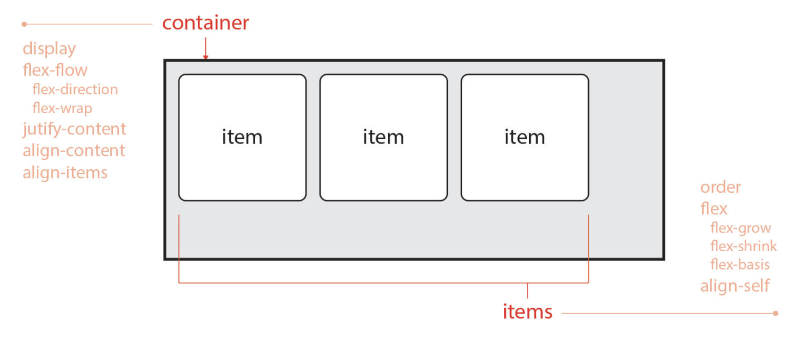
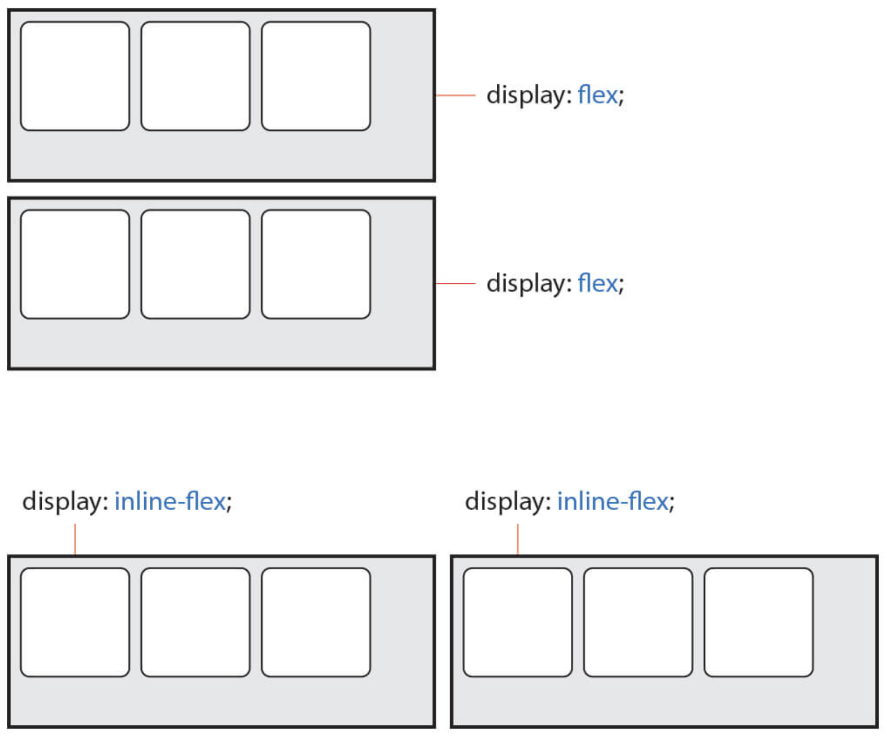
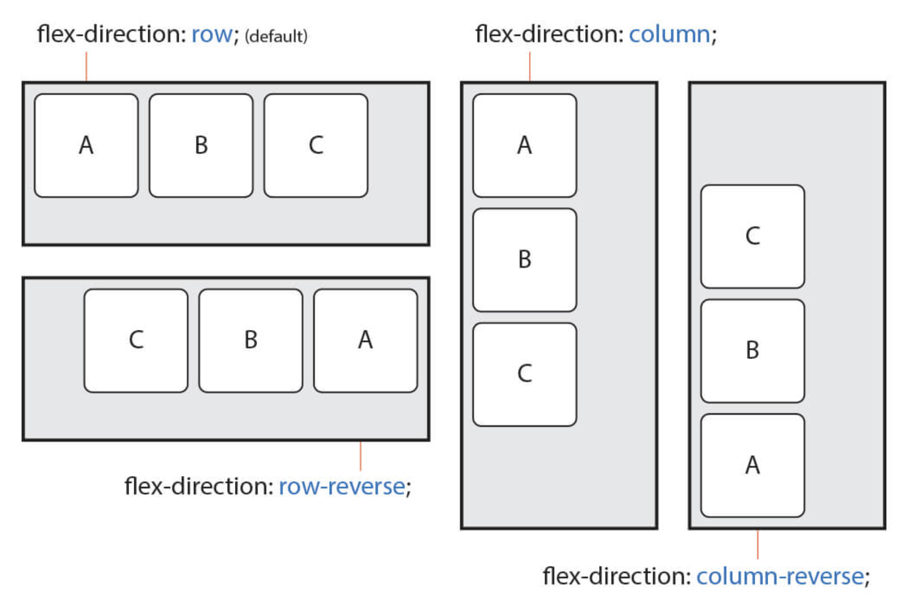
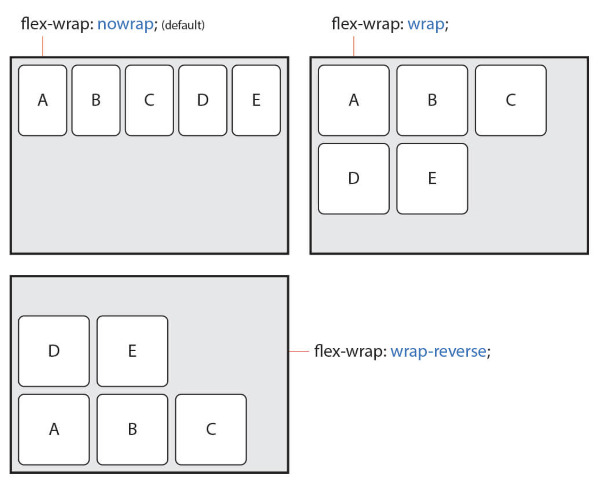
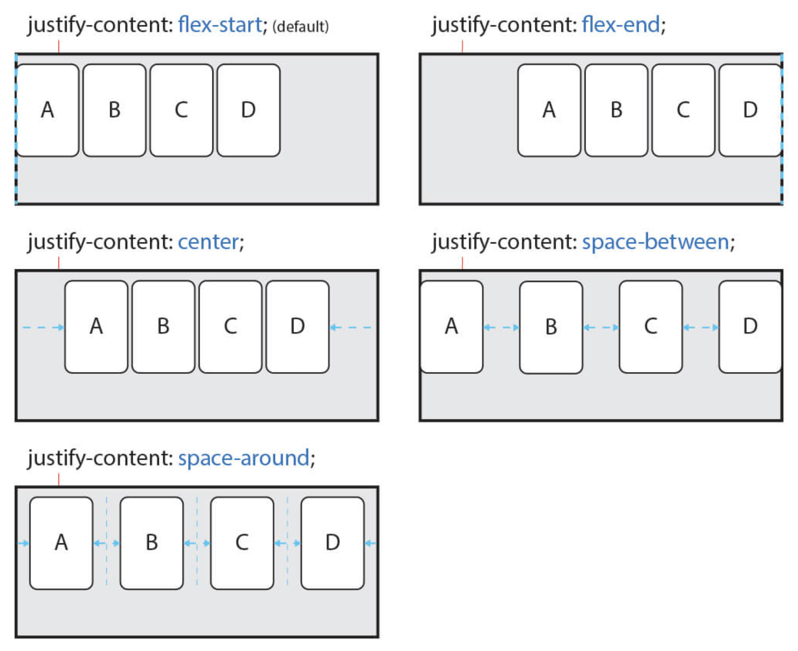
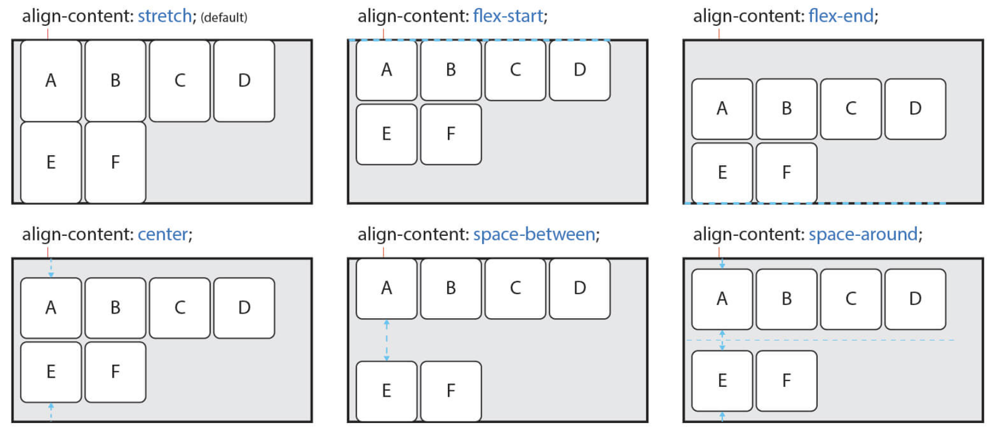
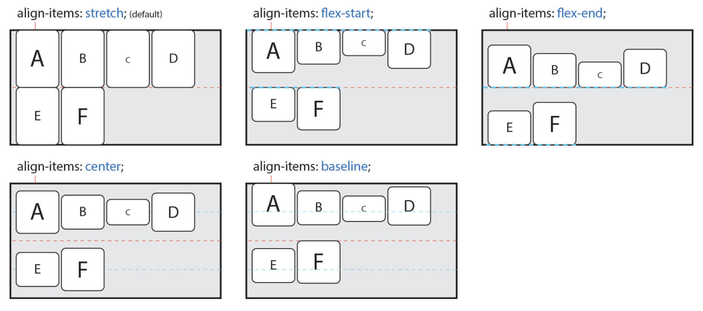

# Flex Layout 01

flex는 **container**와 **item** 두 개의 개념으로 나뉜다.  
Container는 Items를 감싸는 부모 요소이며, 각 Item을 정렬하기 위해선 Container가 필수이다.

# Cointaner에 사용할 수 있는 속성
속성 | 의미
---|---
`display`	| Flex Container를 정의
`flex-flow`|	flex-direction와 flex-wrap의 단축 속성
`flex-direction` |	Flex Items의 주 축(main-axis)을 설정
`flex-wrap` |	Flex Items의 여러 줄 묶음(줄 바꿈) 설정
`justify-content` |	주 축(main-axis)의 정렬 방법을 설정
`align-content` |	교차 축(cross-axis)의 정렬 방법을 설정(2줄 이상)
`align-items` |	교차 축(cross-axis)에서 Items의 정렬 방법을 설정(1줄)

## 1. display
값 | 의미
---|---
**flex** |	Block 특성의 Flex Container를 정의	
**inline-flex** | Inline 특성의 Flex Container를 정의	

`display: flex;`  
Block 요소와 같은 성향(수직 쌓임)을 가진다.  
`display: inline-flex;`  
Inline(Inline Block) 요소와 같은 성향(수평 쌓임)을 가진다.

주의 : 수직과 수평 쌓임은 Items가 아니라 Container이다.
두 값의 차이는 내부의 Items에는 영향을 주지 않는다.

## 2. flex-flow
값 | 의미 | 기본값
---|---|---
**flex-direction** |	Items의 주 축(main-axis)을 설정 |	row
**flex-wrap**	| Items의 여러 줄 묶음(줄 바꿈) 설정 |	nowrap

### flex-direction
Items의 주 축(배치되는 축의 방향)을 설정한다.

`flex-direction: row` 또는 `flex-flow: row` (기본값)  
Itmes를 **수평**축(왼쪽에서 오른쪽으로)으로 표시

`flex-direction: row-reverse`  
Items를 row의 반대 축으로 표시  

`flex-direction: column`  
Items를 **수직**축(위에서 아래로)으로 표시  

`flex-direction: column-reverse`  
Items를 column의 반대 축으로 표시

### flex-wrap
기본적으로 Items는 한 줄에서만 표시되고 줄 바꿈 되지 않고, 지정된 크기(주 축에 따라 width나 height)를 무시하고 한 줄 안에서만 가변한다.  
Items를 줄 바꿈 하려면 값으로 wrap을 사용해야 한다.

`flex-wrap : nowrap` (기본값)  
모든 Itmes를 여러 줄로 묶지 않고 한 줄에 표시

`flex-wrap : wrap`  
Items를 여러 줄로 묶음

`flex-wrap : wrap-reverse`  
Items를 wrap의 역방향으로 여러 줄로 묶음

## 3. justify-content
주 축(main-axis)의 정렬 방법을 설정한다.

값	| 의미
---|---
**flex-start**(기본값)	| Items를 시작점으로 정렬
**flex-end**	| Items를 끝점으로 정렬	
**center**	| Items를 가운데 정렬	
**space-between** |	시작 Item은 시작점에, 마지막 Item은 끝점에 정렬되고 나머지 Items는 사이에 고르게 정렬됨	
**space-around** |	Items를 균등한 여백을 포함하여 정렬

## 4. align-content
교차 축의 정렬 방법을 설정한다.  

주의 : flex-wrap 속성을 통해 Items가 여러 줄(2줄 이상)이고 여백이 있을 경우만 사용할 수 있습니다.
**Items가 한 줄일 경우 align-items 속성을 사용**

값	| 의미
---|---
**stretch**(기본값)	| Container의 교차 축을 채우기 위해 Items를 늘림 - stretch는 교차 축에 해당하는 너비(속성 width 혹은 height)가 값이 auto(기본값)일 경우 교차 축을 채우기 위해 자동으로 늘어난다.
**flex-start**	| Items를 시작점(flex-start)으로 정렬	
**flex-end**	| Items를 끝점(flex-end)으로 정렬	
**center** |	Items를 가운데 정렬	
**space-between**	| 시작 Item은 시작점에, 마지막 Item은 끝점에 정렬되고 나머지 Items는 사이에 고르게 정렬됨	
**space-around** |	Items를 균등한 여백을 포함하여 정렬

## 5. align-items
교차 축에서 Items의 정렬 방법을 설정한다. (Items가 한 줄일 경우 많이 사용)

주의 : Items가 flex-wrap을 통해 여러 줄(2줄 이상)일 경우에는 align-content 속성이 우선이다.  
따라서 align-items를 사용하려면 align-content 속성을 기본값(stretch)으로 설정해야한다.

값 | 의미	
---|---
**stretch** |	Container의 교차 축을 채우기 위해 Items를 늘림
**flex-start** |	Items를 각 줄의 시작점(flex-start)으로 정렬	
**flex-end**	| Items를 각 줄의 끝점(flex-end)으로 정렬	
**center** |	Items를 가운데 정렬	
**baseline** |	Items를 문자 기준선에 정렬

