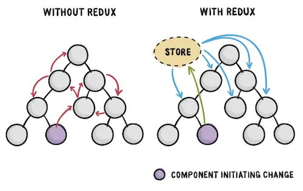
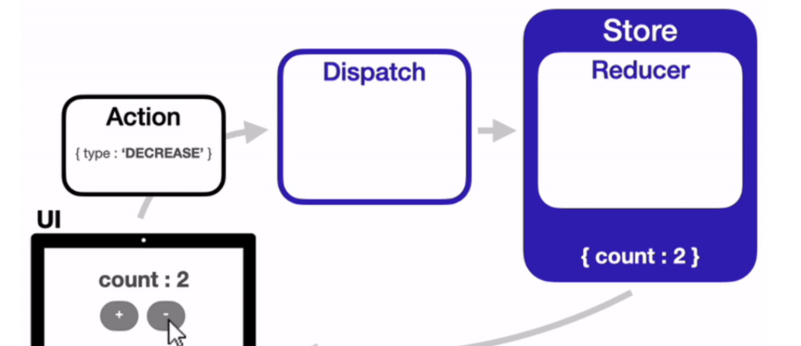

## Redux란
- 여러 컴포넌트가 공유하는 상태 관리 라이브러리.

## 상태(State)
### React에서의 상태 관리
- 자식 컴포넌트들간의 데이터 전달은 상태를 관리하는 부모 컴포넌트를 통해 주고받는다.
- 상태를 관리하는 상위 컴포넌트에서 계속 내려받아야 하기 때문에, 자식이 많아지면 상태관리가 복잡해진다.
### Redux 사용 이유
- 상태를 컴포넌트에 종속시키지 않고, 컴포넌트의 바깥에서 상태를 관리할 수 있게 된다.

## Redux 흐름
### Store
- 컴포넌트와는 별개로, 상태가 관리되는 오직 하나의 공간
- 컴포넌트에서 상태 정보가 필요할때 스토어에 접근
### Action
- 앱에서 스토어에 운반할 데이터
- js object형식
### Reducer
- Action을 Reducer에 전달하여, Reducer가 Store에 상태를 업데이트.
- Action을 Reducer에 전달하기 위해서는 dispatch() method를 이용한다.
### 흐름
1. 상태 변경 이벤트 발생시, 변경될 상태에 대한 정보가 담긴 Action객체 생성
2. Action객체는 Dispatch함수의 인자로 전달
3. Dispatch 함수는 Action객체를 Reducer함수로 전달
4. Reducer 함수는 Action객체의 값을 확인하고, 그 값에 따라 전역 상태 저장소 Store의 상태를 변경
5. 상태가 변경되면 React는 화면을 리렌더링

**즉, Redux에서는 Action->Dispatch->Reducer->Store 순서로 데이터가 단방향으로 전달.**

## Redux의 3가지 원칙
### Single source of truth
애플리케이션의 모든 상태는 하나의 저장소 안에 하나의 객체 트리 구조로 저장된다.(동일한 데이터는 항상 같은 곳에서 가지고 와야 한다)
### State is read-only
상태는 읽기 전용이다. 상태를 변화시키는 유일한 방법은 무슨 일이 벌어질지를 묘사하는 Action 객체를 전달하는 방법 뿐이다.
### Changes are made with pure functions
변경은 순수 함수로만 작성되어야 한다. Action에 의해 상태 트리가 어떻게 변화하는지를 지정하기 위해서는, 엉뚱한 값으로 변경되는 일이 없도록 프로그래머는 순수 reducer를 작성해야 한다.